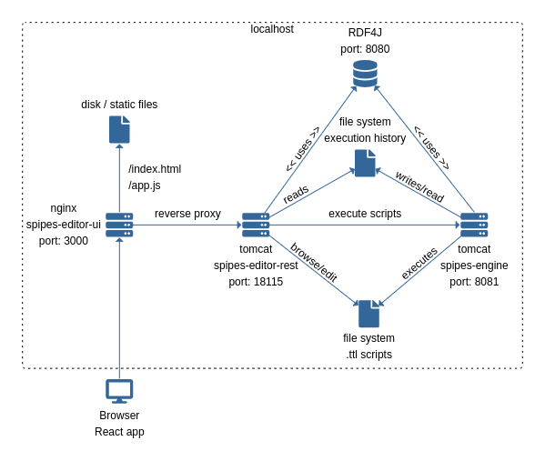

# SPipes Editor UI

We will use `$PROJECT_ROOT` as the root directory of this project, i.e., the directory where this README is located. Similarly, we will define:
- `$SPIPES_EDITOR_ROOT` -- root folder of cloned repository [s-pipes-editor](https://github.com/kbss-cvut/s-pipes-editor)
- `$SPIPES_MODULES_ROOT` -- root folder of cloned repository [s-pipes-modules](https://kbss.felk.cvut.cz/gitblit/summary/s-pipes-modules.git) 
- `$SPIPES_ROOT` -- root folder of cloned repository [s-pipes](https://github.com/kbss-cvut/s-pipes)
- `$SHARED_ROOT` -- root folder that you want to share between docker services and your host system. It is the folder that
  will be visible from docker services as well as from host filesytem and paths to all files will be the same.
  Thus one can copy absolute path to a file from docker service and open it from host filesystem and other way around.
  For linux the typical value would be `/home` or `/home/$user` and for windows the typical value would be `/host_mnt` or
  `/host_mnt/c/Users/user1/code`.
  
### Running Editor UI

Default configuration assumes that:
- you have **at least** docker-compose v2.20.2 (due to https://github.com/docker/cli/issues/4265; earlier versions were not tested)
- all relevant projects are "git cloned" as sibling directories to `$PROJECT_ROOT` (i.e. `$SPIPES_EDITOR_ROOT=$PROJECT_ROOT/../s-pipes-editor`, $SPIPES_MODULES_ROOT=$PROJECT_ROOT/../s-pipes-modules, and `$SPIPES_ROOT=$PROJECT_ROOT/../s-pipes`). 

There are two ways to run the editor, [using docker-compose](#run-editor-using-docker-compose) and [using spe](#run-editor-using-spe-script).

#### Running editor using docker-compose
To run the editor using `docker-compose`, do the following steps:
- `cd $PROJECT_ROOT`
- if on Windows, if not setup create `$PROJECT_ROOT/.env` according to [Windows setup .env and .env.custom-script-paths](#windows-setup-env-and-envcustom-script-paths)
- `docker-compose up`
- open the editor in browser at `http://localhost:3000`. The editor should be showing [example scripts from SPipes repository](https://github.com/kbss-cvut/s-pipes/doc/examples).

#### Run editor using spe script

To run the editor using `spe` script, do the following steps:
- if on Windows, if not setup create `$PROJECT_ROOT/.env.custom-script-paths` according to [Windows setup .env and .env.custom-script-paths](#windows-setup-env-and-envcustom-script-paths)
- `$PROJECT_ROOT/bin/spe <paths-to-script-folders>`
- open the editor in browser at `http://localhost:3000`. The editor should be showing [example scripts from SPipes repository](https://github.com/kbss-cvut/s-pipes/doc/examples).

Use the correct spe script extension:
- Use `spe.sh` if in bash (both linux or wsl distribution).
- Use `spe.bat` if in  windows (both command prompt and powershell)

Note that in windows if using git with `core.autocrlf=true` (set by default) `spe.sh` (and other files) git will replace 
line endings (`LF`) for windows line endings (`CRLF`). In this case the spe.sh script will not be executable in wsl. 
To make the script executable line endings should be replaced.


#### Windows setup .env and .env.custom-script-paths
  `.env` file is used by docker compose by default. The `.env.custom-script-paths` is used by the `spe` script.
  - if running docker-compose.exe or spe.bat in windows  (not docker in wsl distribution) add the :
    - `SHARED_ROOT=/host_mnt/c`
    - `PWD=/host_mnt/$PROJECT_ROOT` _should be absolute path_
  - if running docker-compose or spe.sh in wsl distribution, set variables as follows:
    - `SHARED_ROOT=/mnt/c`


To override default configuration create `$PROJECT_ROOT/.env` and use following variables:
- `CUSTOM_SCRIPT_PATHS` -- to show different SPipes scripts (defaults to `${PROJECT_ROOT}/../s-pipes/doc/examples`).
  Use separator ";" to add multiple paths. The path must be absolute and the same as in host filesystem.
- `SCRIPTRULES` --  to set up different rules to validate SPipes scripts
  (defaults to `${PROJECT_ROOT}/../s-pipes-editor/src/main/resources/rules`),
- `RDF4J_SERVER_URL` -- to set up different Rdf4j server (defaults to internal docker service at `http://rdf4j:8080/rdf4j-server`).
  **Note that this variable must be consistent with variable `RDF4J_PCONFIGURL`**.
- `RDF4J_REPOSITORYNAME` -- to set up different Rdf4j repository name where SPipes logs from execution are created
  (defaults to `s-pipes-hello-world`). **Note that this variable must be consistent with
  variable `RDF4J_PCONFIGURL`**.
- `RDF4J_PCONFIGURL` -- to set up configuration of Rdf4j repository where SPipes logs from execution are created
  (defaults to `$SPIPES_ROOT/doc/examples/hello-world/config.ttl`). **Note that this variable must be consistent with
  variables `RDF4J_SERVER_URL` and `RDF4J_REPOSITORYNAME`**.
- `SPIPES_ENGINE` -- to set up different s-pipes engine (defaults to internal docker service `http://s-pipes-engine:8080/s-pipes/`),
- `SPIPES_EDITOR_REST` -- to set up different s-pipes-editor backend (defaults to internal docker service `s-pipes-editor-rest:18115`).


### Building

```
$ npm install
```

IMPORTANT - https://github.com/facebook/create-react-app/issues/10811.
The `npm@7.13.0` version is required and `npm update --force` command.

Will create a `dist` directory containing your compiled code.

Depending on your needs, you might want to do more optimization to the production build.

## Development

Run development server

```
$ npm run dev
```

### Dockerization
The docker image of SPipes Editor UI can be built by `docker build -t s-pipes-editor-ui .`

Then, SPipes Editor UI can be run as `docker run -e SERVICE_URL=<SPIPES_BACKEND_URL> -p 3000:80 s-pipes-editor-ui`   
where <SPIPES_BACKEND_URL> denotes the URL where SPipes backend is running.

### Docker-compose

You can run editor together with backend using docker orchestration. The docker-compose is composed of 4 services and can be run via `docker-compose up`:
* [chlupnoha/s-pipes-editor-ui:latest](https://hub.docker.com/repository/docker/chlupnoha/s-pipes-editor-ui) - accessible on `http://localhost:3000`
* [chlupnoha/s-pipes-editor-rest:latest](https://hub.docker.com/repository/docker/chlupnoha/s-pipes-editor-rest) - accessible on `http://localhost:18115` with [configuration options](https://github.com/kbss-cvut/s-pipes-editor#dockerization)
* [chlupnoha/spipes-engine:latest](https://hub.docker.com/repository/docker/chlupnoha/spipes-engine) - accessible on `http://localhost:8081` with [configuration options](https://github.com/kbss-cvut/s-pipes#dockerization) 
* [eclipse/rdf4j-workbench:amd64-3.5.0](https://hub.docker.com/r/eclipse/rdf4j-workbench) - accessible on `http://localhost:8080/rdf4j-workbench`

**Required manual steps:** 
* s-pipes-engine
    * The service does not automatically create the repository in RDF4J, so manual creation of a repository is required (after running `docker-compose up`).
      * First open the RDF4J Workbench: `http://localhost:<port>/rdf4j-workbench` where `<port>` is the RDF4J service port specified in `docker-compose.yml`.
      * Then follow these instructions: [Creating a Repository](https://rdf4j.org/documentation/tools/server-workbench/#:~:text=for%20the%20repository.-,Creating%20a%20Repository,-Click%20on%20%E2%80%9CNew) (For repository type use for example Native Store.)
    * The logging configuration for RDF4j is hardcoded in the image, but it could override via `_pConfigURL` param. However, it is not a convenient format to work. Also both servies must to share volume or the config has to be exposed.

* Notes
  * volumes of `/tmp:/tmp` is currently required for sharing configuration for module debug
  * volumes of `/home:/home` is currently required for sharing the scripts
  * volumes of `/usr/local/tomcat/temp/` is currently required for sharing execution logs


Architecture images

### Note
> Skeleton is from - React Starter Boilerplate with Hot Module Replacement and Webpack 4

###License
Licensed under GPL v3.0.
